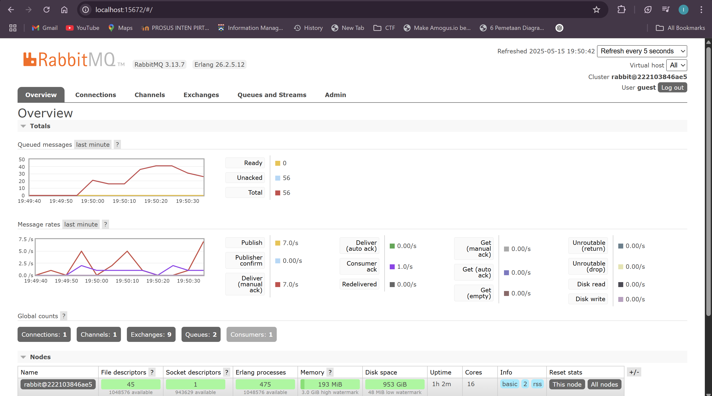

## Module 9 Reflection
Ivan Jehuda Angi - 2306152222 

---
### a. What is AMQP?

AMQP stands for Advanced Message Queuing Protocol. It is a protocol used for sending messages between systems in a reliable, secure, and asynchronous way. AMQP is often used in message brokers like RabbitMQ to allow different services or applications to communicate with each other by sending and receiving messages through queues.

### b. What does it mean? guest:guest@localhost:5672

This is a connection string used to connect to a RabbitMQ server. The first `guest` is the username, the second `guest` is the password, and `localhost:5672` means the RabbitMQ server is running locally (on the same machine) and is listening on port `5672`, which is the default port for AMQP connections.

### Simulation slow subscriber

The RabbitMQ dashboard shows that there are currently 56 unacknowledged messages in the queue, with none ready to be delivered. This means that messages have been received by the subscriber but are still being processed and not yet acknowledged. This aligns with the fact that the subscriber includes a sleep delay, which causes message processing to slow down and messages to build up in the queue temporarily.

The message rates chart shows that messages are being published at a rate of 7.0 messages per second and delivered at the same rate with manual acknowledgments. This confirms that the publisher is actively sending data in bursts , and the subscriber is gradually consuming them, resulting in the visible queue accumulation.

